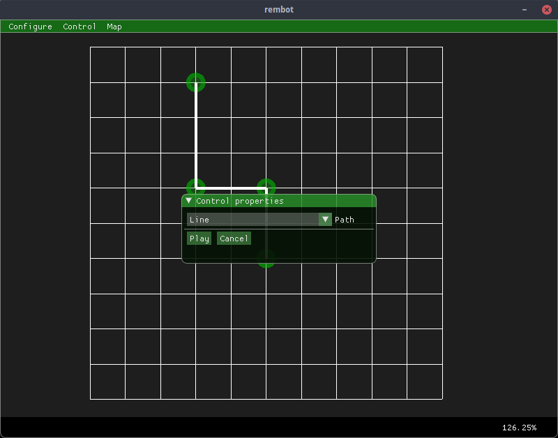

# rembot

Дистанционное управление роботом NXT с помощью графического планирования движения по заранее заданному маршруту.

  

Задачи:
1. Спроектировать и реализовать робота, отвечающим следующим
требованиям:возможность движения вперед, налево и направо
2. Спроектировать протокол передачи данных по bluetooth
3. Разработать графическое приложение на ПК, которое позволит
проектировать движение робота по заданному маршруту.
4. Разработать программное обеспечение робота, которое позволит ему на
основании интерфейса bluetooth принимать команды от графического
приложения с помощью спроектированного протокола и отдавать результат
выполнения команды.

Зависимые библиотеки: boost, blez, imgui, sfml.

[Дополнительная информация](docs.pdf)
